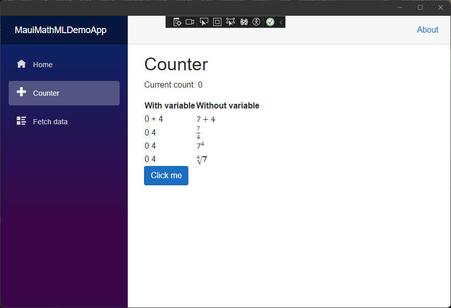
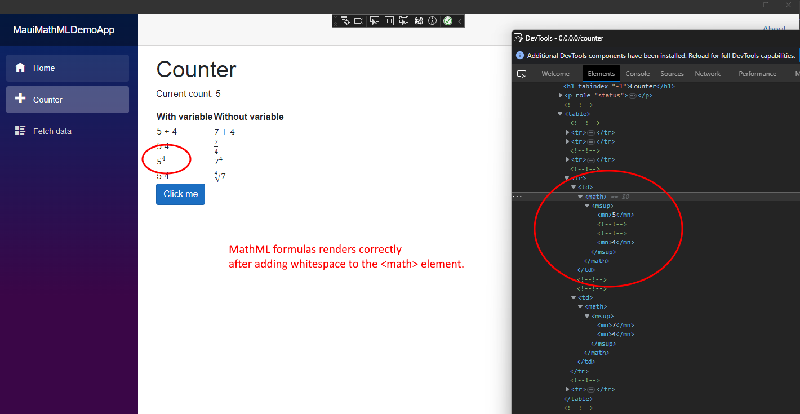
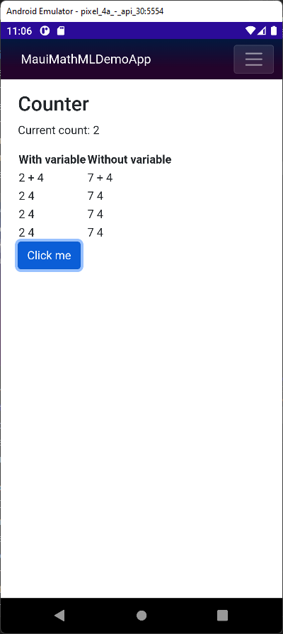
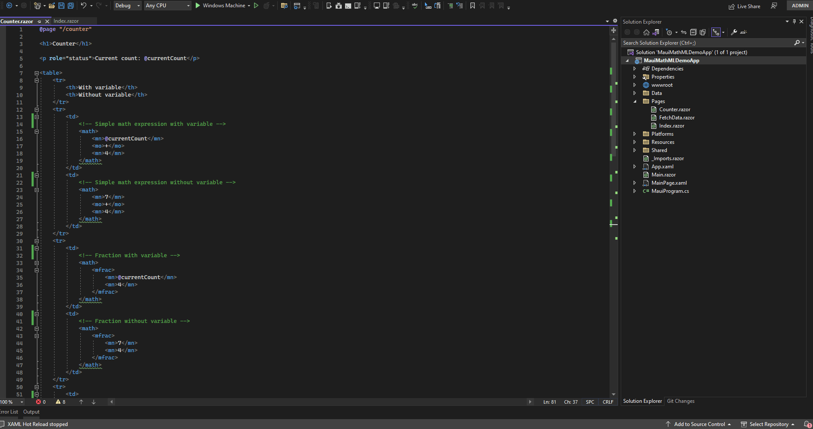

# Description of the bug

This app demonstrates the issue with Blazor and MathML. This app is the default Maui Blazor template 
except for the Counter page. Four MathML formulas have been added, for each formula one static version and 
one dynamic version. The dynamic formula contains the counter variable, the static version is fully hard coded.


```
    <tr>
        <td>
            <!-- Square root with variable -->
            <math>
                <mroot>
                    <mn>@currentCount</mn>
                    <mn>4</mn>
                </mroot>
            </math>
        </td>
        <td>
            <!-- Square root without variable -->
            <math>
                <mroot>
                    <mn>7</mn>
                    <mn>4</mn>
                </mroot>
            </math>
        </td>
    </tr>
```

As can be seen below, the rendering of the dynamic version (on the left) is incorrect.



When you increase the counter, the variable in the left does increase but the rendering remains incorrect. 
If you inspect the generated HTML in the developer tool, the DOM looks exactly the same as the correctly
rendered static formulas.

However, when you edit the dynamic MathML DOM element in the developer tool by just adding some whitespace in front 
of the math element, suddenly the browser correctly renders the element. When adding some whitespace at a 
higher level, all formulas suddenly render correctly. The binding with the variable however seems to break
because the dynamic value is no longer being updated when increasing the counter.



The Android emulator (Pixel 4A, API 30, Android 11) is not able to render the MathML formulas at all. 
My Motorola Android 12 does correctly render MathML but breaks in the same way as the Windows runtime does.

Android 11 Pixel 4A API 30 emulator:



Android 12 Motorola:


It's hard to determine from the outside whether the problem is located in Blazor or in the browser or a combination of both.

Demonstration in animated gif:



